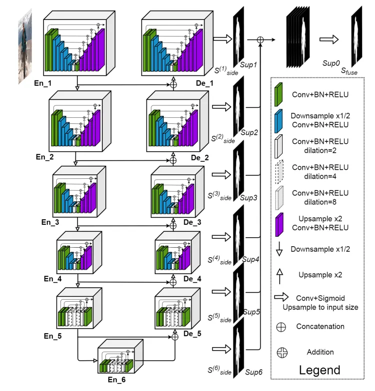
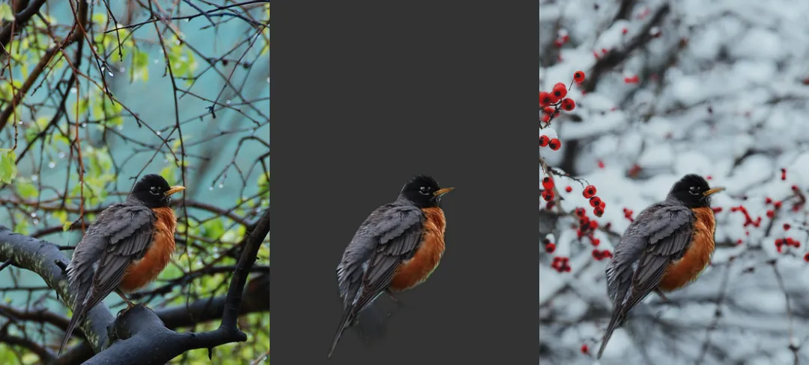

# Deploying U²-Net for Intelligent Background Removal

**English** | [**简体中文**](locales/README.zh-CN.md)

## NVIDIA AIBOX Series

Both the AIBOX-OrinNano and AIBOX-OrinNX are equipped with original NVIDIA Jetson Orin core modules. They come standard with an industrial-grade all-metal enclosure featuring an aluminum alloy structure for thermal conduction. The top cover utilizes a slatted grille design on the sides for highly efficient heat dissipation, ensuring computational performance and stability under high-temperature operation to meet the demands of various industrial applications.

| | AIBOX-OrinNX | AIBOX-OrinNano |
| :--- | :--- | :--- |
| Module | Jetson Orin NX 16GB | Jetson Orin Nano 8GB |
| AI Performance | 157 TOPS | 67 TOPS |
| GPU | 1024-core NVIDIA Ampere architecture GPU with 32 Tensor Cores | 1024-core NVIDIA Ampere architecture GPU with 32 Tensor Cores |
| CPU | 8-core Arm Cortex-A78 64-bit CPU<br>2MB L2 + 4MB L3 | 6-core Arm Cortex-A78 64-bit CPU<br>1.5MB L2 + 4MB L3 |
| DDR | 16GB 128-bit LPDDR5 102.4GB/s | 8GB 128-bit LPDDR5 68 GB/s |
| HDMI | 4K@60Hz | 4K@30Hz |

## Background Removal

Background Removal technology has become an essential tool in the field of image processing, primarily applied in scenarios such as image editing, data analysis, and application development.

Typical Applications:

(1) **Image Processing:** E-commerce product cutouts, portrait retouching, and medical image analysis.

(2) **Video Processing:** Real-time green screen replacement and dynamic object tracking.

(3) **Scientific Preprocessing:** Enhancing quantification accuracy in meteorological chromatography analysis through background removal.

## U²-Net

U²-Net (U-squared Net) is a deep learning-based image segmentation model specifically designed for high-precision background removal tasks. Its core technical features and application scenarios include:

- **Dual U-shaped Encoder-Decoder Structure**
- **Deep Supervision and Loss Functions**
- **Lightweight Design**



### **Download Source Code**

```bash
$ git clone --recursive --depth=1 https://github.com/dusty-nv/jetson-inference
```

**Build / Install**

> Reference: [https://github.com/dusty-nv/jetson-inference/blob/master/docs/building-repo-2.md](https://github.com/dusty-nv/jetson-inference/blob/master/docs/building-repo-2.md)

**Run Examples**

```bash
# Remove the background (with alpha)
$ ./backgroundnet.py images/bird_0.jpg images/test/bird_mask.png                   

# Replace the background
$ ./backgroundnet.py --replace=images/snow.jpg images/bird_0.jpg images/test/bird_replace.jpg
```


