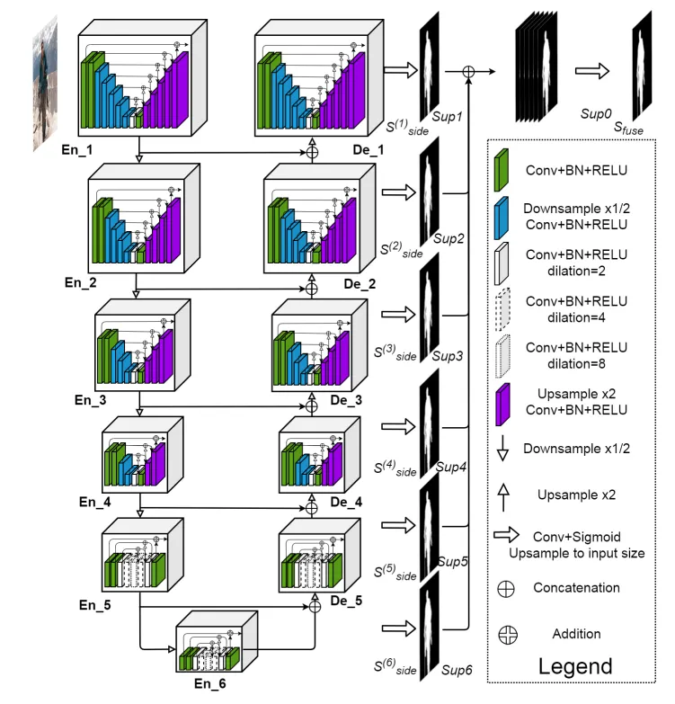
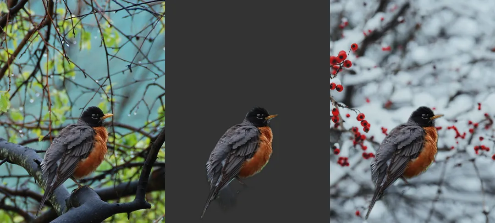

# 部署 U²-Net 实现智能背景移除

## 背景移除

背景移除本质上是一个像素级二分类问题：对每个像素判定其归属前景或背景。该技术已成为图像处理领域的重要工具，并在多条业务链路中承担前置环节的角色：

- 电商与内容生产：产品图抠像、批量背景置换、人像美化。按次调用云端 API 的单张成本看似低廉，但在日处理量达到万级规模时，调用成本、上传带宽与素材隐私均会成为制约因素。
- 视频会议与直播：实时背景虚化/置换（绿幕替代方案）。此类场景对延迟高度敏感，云端推理的单次往返延迟通常在数十至上百毫秒量级，端侧推理是满足实时性要求的合理路径。
- 机器视觉前处理：将背景抑制后输入检测/分类网络，相当于执行一次注意力裁剪，可显著提升下游模型在复杂背景下的精度，同时降低无效像素带来的算力开销。

## 硬件底座

AIBOX-OrinNano 和 AIBOX-OrinNX 均搭载 NVIDIA 原装 Jetson Orin 核心板模组，标配工业级全金属外壳，铝合金结构导热，顶盖外壳侧面采用条幅格栅设计，高效散热，保障在高温运行状态下的运算性能和稳定性，满足各种工业级的应用需求。

| | AIBOX-OrinNX | AIBOX-OrinNano |
| :--- | :--- | :--- |
| 模组 | Jetson Orin NX 16GB | Jetson Orin Nano 8GB |
| AI 性能 | 157 TOPS | 67 TOPS |
| GPU | 搭载 32 个 Tensor Core 的 1024 核 NVIDIA Ampere 架构 GPU | 搭载 32 个 Tensor Core 的 1024 核 NVIDIA Ampere 架构 GPU |
| CPU | 8 核 Arm Cortex - A78 64 位 CPU<br>2MB L2 + 4MB L3 | 6 核 Arm Cortex A78 64 位 CPU<br>1.5MB L2 + 4MB L3 |
| DDR | 16GB 128 位 LPDDR5 102.4GB/s | 8GB 128 位 LPDDR5 68 GB/s |
| HDMI | 4K@60Hz | 4K@30Hz |

## 模型解析

U²-Net 由阿尔伯塔大学 Qin Xuebin 等人提出，其目标问题是显著性目标检测（SOD）：在不指定类别的前提下，由网络自动定位画面中视觉显著性最高的主体区域，与背景移除任务的目标完全一致。



### 3.1 嵌套 U 型结构（RSU 模块）

标准 U-Net 采用单层"编码器—解码器"结构。U²-Net 则将每个 stage 本身构造为一个小型 U-Net（RSU，ReSidual U-block），由此形成**两级嵌套的 U 型结构**，这也是其名称中 "U²" 的由来。

其工作机制可类比嵌入式系统中的**中断嵌套机制**：标准 U-Net 相当于单层中断嵌套，而 RSU 相当于允许每个中断服务程序内部再次嵌套中断——每一级 stage 均能在自身分辨率尺度上独立完成"下采样获取全局上下文、上采样恢复局部细节"的过程。由此，网络在不显著增加计算量的前提下，同时获取多尺度上下文信息与局部高频细节，这对发丝、物体边缘等细节区域的分割质量至关重要。

### 3.2 深监督（Deep Supervision）

解码器每一级均输出一张显著性预测图，分别计算损失后加权融合得到最终结果。这类似于在流水线的**每一级均设置 checkpoint 进行校验**，而非仅在末端验收：梯度信号得以更顺畅地回传至浅层网络，使较小规模的模型也能获得稳定的训练效果。

### 3.3 规格与训练数据

| 项目 | 参数 |
| --- | --- |
| 论文指标输入分辨率 | 320×320 |
| 标准版权重（u2net.pth） | 176.3 MB |
| 轻量版权重（u2netp.pth） | 4.7 MB |
| 训练集 | DUTS-TR（10,553 张显著性标注图） |
| 官方变体 | u2net_human_seg（人像分割专用，基于 Supervisely Person Dataset 训练） |

jetson-inference 中的 `backgroundNet` 采用**全卷积版本的 U²-Net**，因而对任意输入分辨率均兼容：由于网络不含全连接层，输入尺寸不受 320×320 限制；输入分辨率越高，边缘细节越精细，推理耗时亦相应增加，部署时需在精度与帧率之间权衡。


## 部署实战

### 系统准备

满功耗模式：

```bash
$ sudo nvpmodel -m 0        # MAX-N 满功耗模式（Orin Nano 默认 15W）
$ sudo jetson_clocks        # 锁定 CPU/GPU/EMC 频率到最大值
```

### 获取源码并编译

```bash
$ git clone --recursive --depth=1 https://github.com/dusty-nv/jetson-inference
```

编译安装过程参考官方文档：[https://github.com/dusty-nv/jetson-inference/blob/master/docs/building-repo-2.md](https://github.com/dusty-nv/jetson-inference/blob/master/docs/building-repo-2.md)

> 亦可采用项目自带的 Docker 方式运行：`cd jetson-inference && docker/run.sh`。镜像内已预编译全部示例，可执行文件位于容器内 `build/aarch64/bin/` 目录。

### 静态图片：移除背景 / 置换背景

```bash
# 移除背景（输出带 alpha 通道的 PNG）
$ ./backgroundnet.py images/bird_0.jpg images/test/bird_mask.png

# 以指定图片置换背景（自动缩放至与输入同分辨率）
$ ./backgroundnet.py --replace=images/snow.jpg images/bird_0.jpg images/test/bird_replace.jpg
```

**首次运行说明**：程序将自动下载 `Background-U2Net/u2net.onnx` 模型，随后 TensorRT 针对当前设备的 GPU 配置执行引擎编译优化，该过程**约需 10 分钟**（公开实测口径）。编译产物会被缓存，后续启动即为正常速度。



### 实时视频流：摄像头 / 视频文件 / RTSP

`backgroundnet` 的输入输出遵循 jetson-inference 统一的流协议，切换输入源无需修改代码：

```bash
# CSI 或 USB 摄像头实时背景移除
$ ./backgroundnet.py /dev/video0

# 摄像头实时背景置换
$ ./backgroundnet.py --replace=images/coral.jpg /dev/video0

# 视频文件（需提供完整 URI）
$ ./backgroundnet.py file:///absolute/path/to/video.mp4

# 网络摄像头 / 安防 RTSP 流
$ ./backgroundnet.py rtsp://192.168.1.100:554/stream
```

输出侧同样灵活：默认输出至显示器，也可指定输出流保存为视频文件，或通过 WebRTC 推流至局域网浏览器端查看——适配"设备部署于产线现场、人员在办公区远程查看"的典型部署形态。
